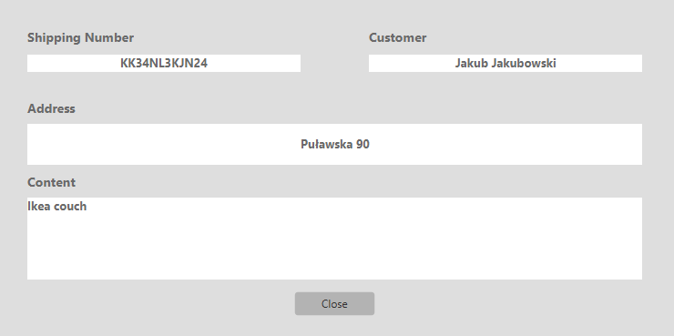

# Package Management System

## Table of contents
* [General info](#general-info)
* [Technologies](#technologies)
* [Screenshots](#screenshots)

## General info
Application created using JavaFX and SQLite databases that allows user to manage shipments, add, delete and edit information.

## Technologies

* Java
* JavaFX
* SQLite

## Screenshots
**Login**

 

**Sign up**

**Main window**

 

**Add and edit**

  

**More information**

